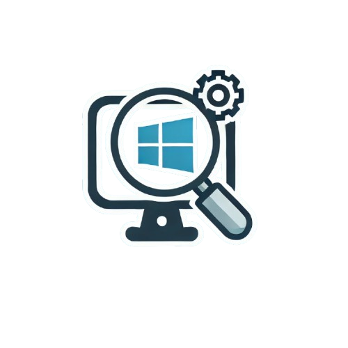

<p align="center">
  
</p>
<h1 align="center">WinSysInsight</h1>

<p align="center">
  <b>A Professional Windows Diagnostic Tool for Engineers and IT Professionals</b>
</p>

<p align="center">
  <a href="https://github.com/oussama-zbair/WinSysInsight/actions">
    
  </a>
  <a href="https://github.com/oussama-zbair/WinSysInsight/issues">
    
  </a>
  <a href="https://github.com/oussama-zbair/WinSysInsight/blob/main/LICENSE">
    
  </a>
</p>

---

## 🌟 Features

- **Comprehensive System Diagnostics**: Retrieve detailed information about your CPU, memory, storage, network, and more.
- **HTML Report Generator**: Generates a visually appealing and organized HTML report for easy analysis.
- **CLI and GUI Options**: Use the tool via the command line or an optional GUI for user-friendly interaction.
- **Automated Testing**: Includes Pester tests for ensuring reliability.
- **Secure and Open Source**: Built with security and transparency in mind.

---

## 📂 Repository Structure

```plaintext
WinSysInsight/
├── src/
│   ├── Diagnostic.ps1          # Core diagnostic script
│   ├── ReportGenerator.ps1     # Converts output to HTML
│   └── Modules/                # Modular diagnostic scripts
│       ├── CPU.ps1             # CPU diagnostics
│       ├── Memory.ps1          # Memory diagnostics
│       └── Network.ps1         # Network diagnostics
├── scripts/
│   └── setup.ps1               # Installation script
├── tests/
│   └── Diagnostic.Tests.ps1    # Pester tests for validation
├── .github/
│   └── workflows/
│       └── ci.yml              # GitHub Actions workflow for CI/CD
├── docs/
│   ├── Installation.md         # Installation instructions
│   ├── Usage.md                # Usage guide
│   └── Features.md             # Detailed feature list
├── output/                     # Generated reports
├── README.md                   # Project overview
└── LICENSE                     # Project license (MIT)
